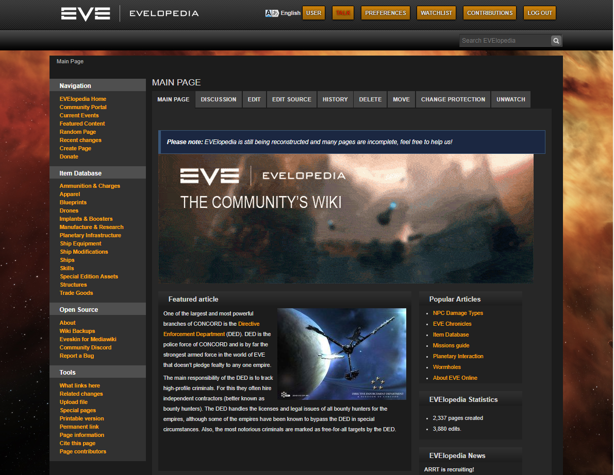

# Evelopedia

Note: This theme was designed for an older version of mediawiki and probably does not work with the current version. The styles will need to be updated for the new elements. If you do this and use the theme, please open a pull request! I will merge your changes.

Eveskin is a skin for Mediawiki. Eveskin is a fork of the MonoBook skin with redone CSS, and uses many of the same assets. For the visual appearance of the skin to match the classic EVElopedia site,
users will have to match the same extensions found in the installation of evelopedia.org, as the CSS is edited specifically for these extensions.

While the installation template says to use "Eveskin" as the archive name, to install you will need to rename the skin folder as "Monobook" and overwrite the existing Monobook skin. The CSS file can then be configured to work without extensions. 

